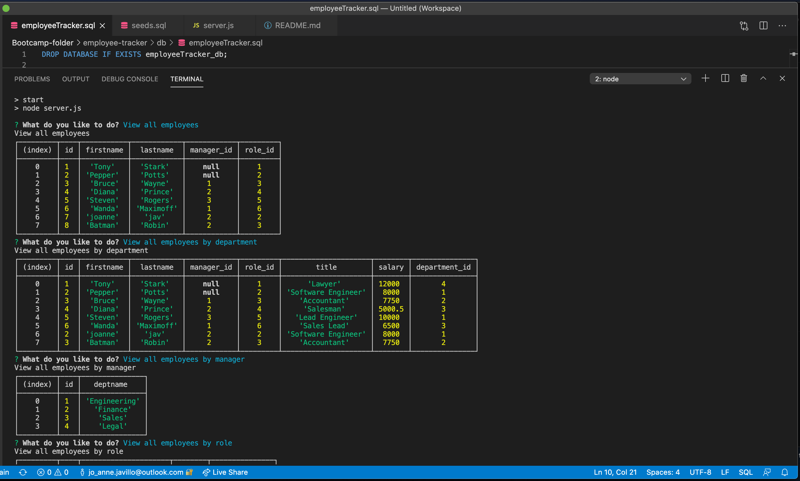
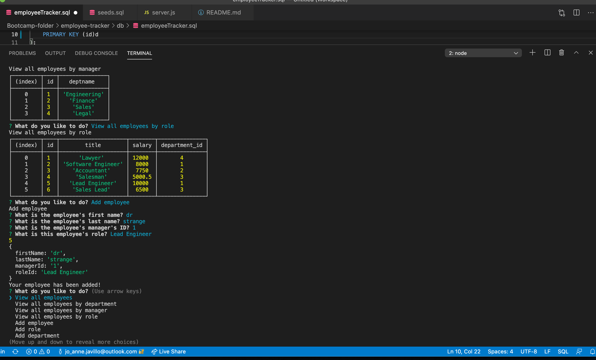

# employee-tracker

## Description 
- This application is all about creating interfaces that will be easy for non-developers to view and interact with information stored in databases.
- The application is build using a command-line      application that at a minimum will allow the user to:
    - add departments, roles, employees
    - view departments, roles, employees,
    - update employee roles
    - delete departments, roles and employees

 ---
# Table of Contents 

  - [Description](#Description)
  - [Technologies](#Technologies)
  - [Links](#Links)
  - [Screenshots](#Screenshots)
  - [Video](#Video)
  - [Challenges](#Challenges)
  - [License](#License)
  - [Questions](#questions)
---

## Technologies
node js, npm, inquirer, MySQL

---
## Links
 - Github: (https://github.com/joannejavillo/employee-tracker)
 - Full Video: (https://drive.google.com/file/d/1-FTAupI--m1rsl4m0pAz_MESI3PzHIdU/view?usp=sharing)
 

---
## Screenshots
 "test run of the code"
---

 "another screenshot of running the code"
---

 "screenshot of adding an employee" 
---
## Video

"Video of running the code"

## Challenges
 - My SQL shut down and it took me two times to uninstall and reinstall to make it work again.
---
## License
- MIT
---
## Questions
If you have any questions you can contact me at jo_anne.javillo@outlook.com or you can visit my gitHub page: (https://github.com/joannejavillo)